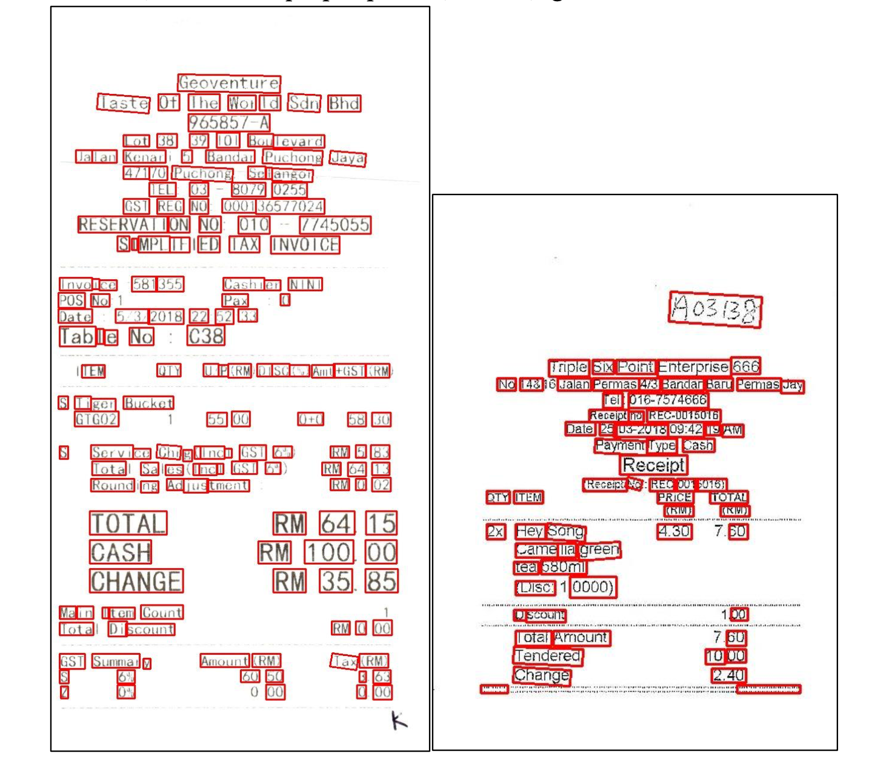
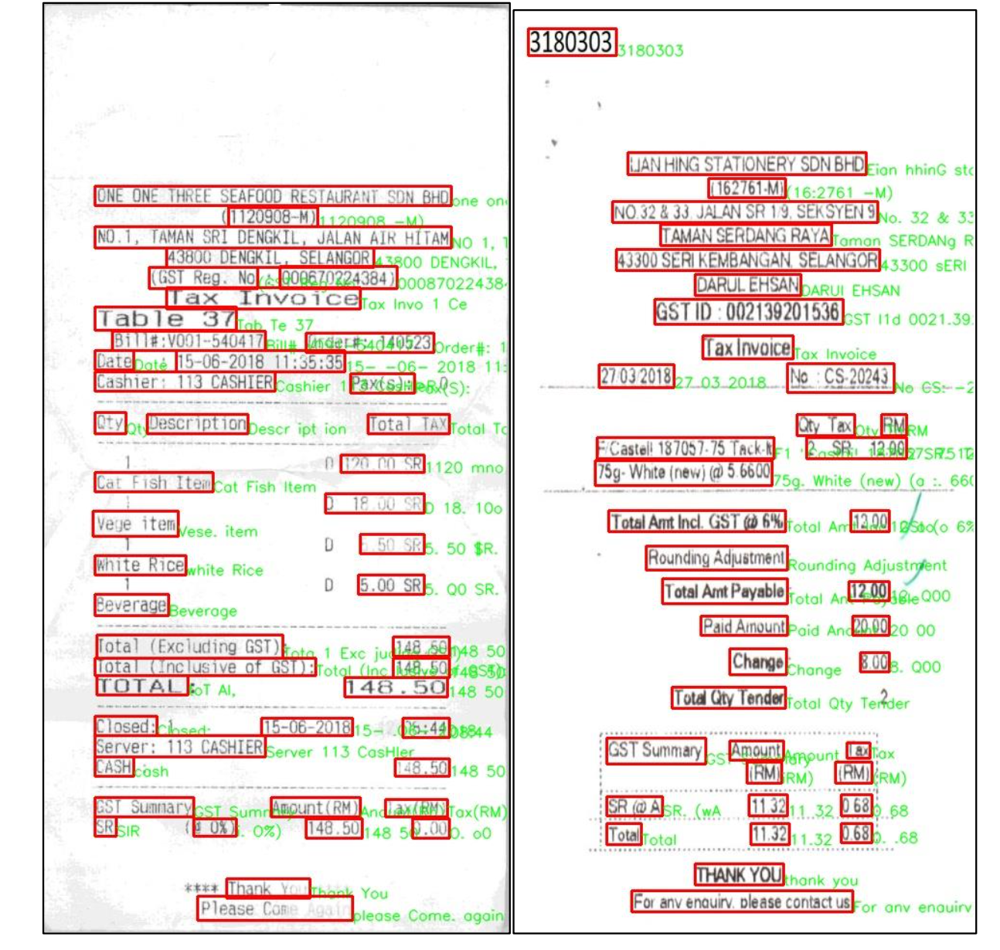
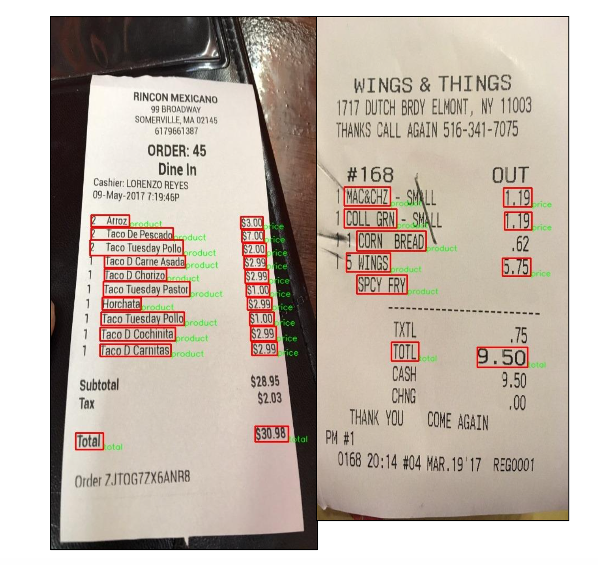
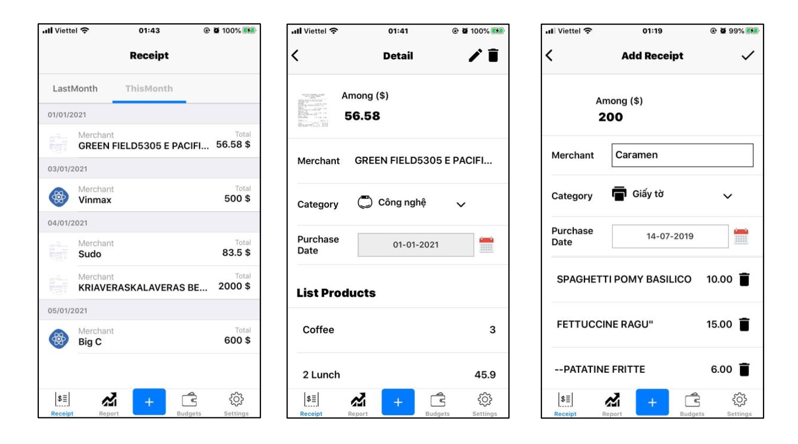
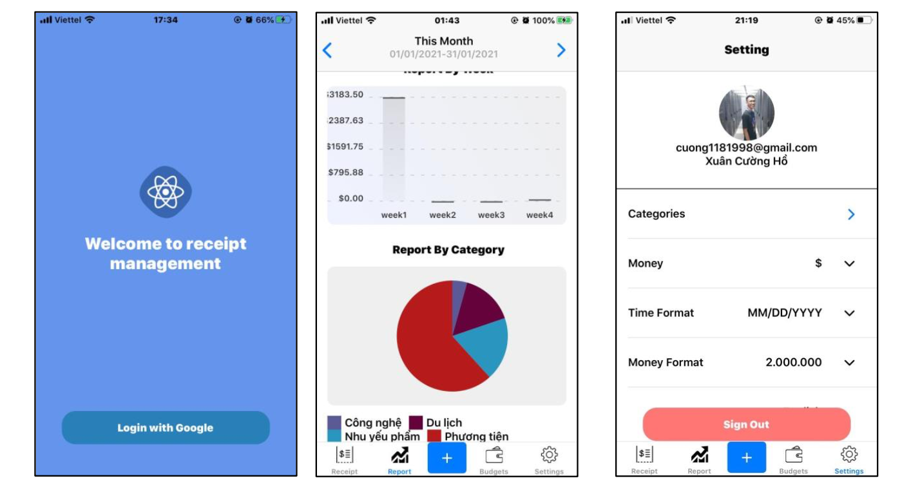

# This is mobile development for Receipt Management development

Author: cuong.hx160537  
Contact: cuong1181998@gmail.com  
Purpose: Application for thesis 2020.1
___
### Setup (IOS) 
Description: This project setup and build in IOS environment, work pretty well in IOS (iphone 6, 6S), haven't setup in Android yet but it build base on Expo, so sound it's will be okay. Refer to: https://expo.io/ 
- Pre-condition: `Yarn or NPM, Xcode`

1. Install node_modules: `npm install`
2. Link library: `cd ios && pod install`
3. Build:
- stimulator: `npm run start` to start metro server and `npm run ios` for run ios stimulator
- real device: `open ios/ReceiptManagement.xcworkspace` to open project in xcode, choose your device in toolbar, and `run`. (Note: Edit schema `Debug` for development, `Release` for production)

### Additional information 
This project contain OCR support for quickly insert image. Go to link below for more information about it:  

#### Script Evaluation: 
- Refer to the completion https://rrc.cvc.uab.es/?ch=13
___
#### Dataset:  
- SROIE: https://drive.google.com/drive/folders/1ShItNWXyiY1tFDM5W02bceHuJjyeeJl2  
- CORD: https://github.com/clovaai/cord  
___
#### Detection:  
- Solution 1: CHARNET: https://colab.research.google.com/drive/1EcY3qut7ZS-4pwB4o76oM8LQ7PKRLLrx?usp=sharing
- Solution 2: CRAFT: https://colab.research.google.com/drive/1OMkdbb89npqFIJvxH96q_rNtNcrAKTd0?usp=sharing
- Solution 3: CTPN: https://colab.research.google.com/drive/1glmkHuEVDeaI9iQb2MEbWjoLVKHWkWBs?usp=sharing
- Solution 4: EAST: https://colab.research.google.com/drive/1HjATwCfmijPURcFx1ZAZ9GTfrCKzlrmv?usp=sharing

##### Result: https://docs.google.com/spreadsheets/d/13VqO-8kEyyzuZvdHNyVBou9SizqeorQZItWIcx11O-8/edit?usp=sharing
___
#### Recognition:  

- Refer to repo: https://github.com/clovaai/deep-text-recognition-benchmark  

- Code generate model test: https://colab.research.google.com/drive/1HjATwCfmijPURcFx1ZAZ9GTfrCKzlrmv?usp=sharing,%20https://colab.research.google.com/drive/1P_shfsg9h4VuCn8Fepqt9LKWeZf6UtJ-?usp=sharing

- Code generate data for evaluate: 
https://colab.research.google.com/drive/1AV-DUwwqcD6QX5Mn0HyiI6Q_mLAaFF7l?usp=sharing

##### Result: https://docs.google.com/spreadsheets/d/1z_3xsouXNo5cBfgOoQcufaozNpaZkbl2PS7iy07h4q4/edit?usp=sharing
___
### Some represent result:
#### Detection:

#### Recognition:

#### Identify:

#### App:

